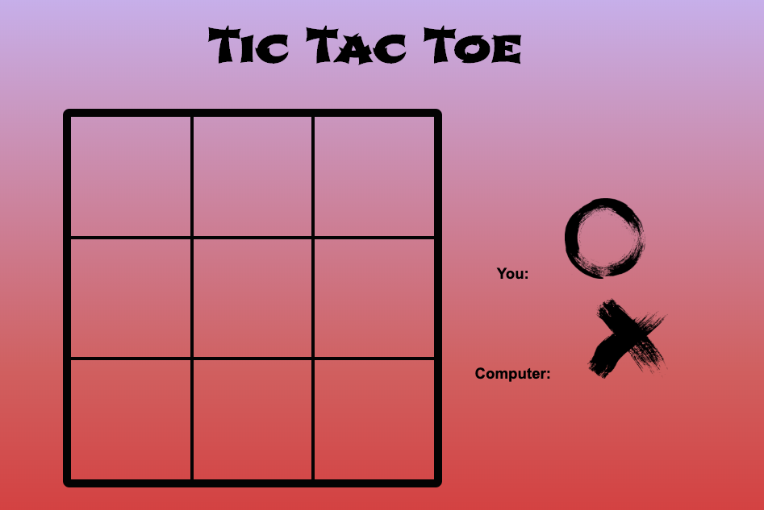

# Tic Tac Toe

## This is not invincible, but is a Tic Tac Toe Game. Specs: 
- 3 x 3 grid
- User and computer play turn by turn
- The board and the moves are displayed after each turn
- Once a game is won, the winner is announced and a new game can be started

Made by [Cristobal Heiss](https://github.com/Ceheiss)

The game has two players (human, the "O", and computer, the "X"). Human always starts playing and the computer follows up soon after. If no player is able to get a line (horizontal, vertical, or across), the game is a tie.

Changes for the future: Choose "O" or "X", make it unbeatable.

## Sample code
```javascript
 // builds each block, adds them to the array and provide an event listener
function buildBlock(number){
  let block = document.createElement('div');
  block.className = "grid-block";
  block.setAttribute('data-block-number', number);
  grid.appendChild(block);
  block.addEventListener('click', function(){
    handleTurn(block);
  })
  blocksArray.push(block)
  return blocksArray;
}

// Creates the playing grid and calling the function
function createGrid(){
  for (var i = 0; i < 9; i++){
    buildBlock(i);
  }
}

createGrid();
  ```
# [Play it here](   https://ceheiss.github.io/tic-tac-toe//)
